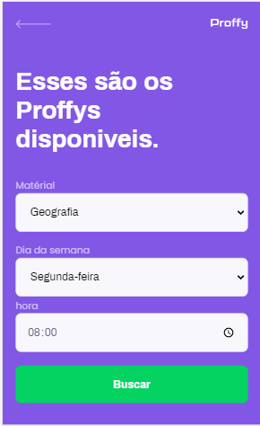
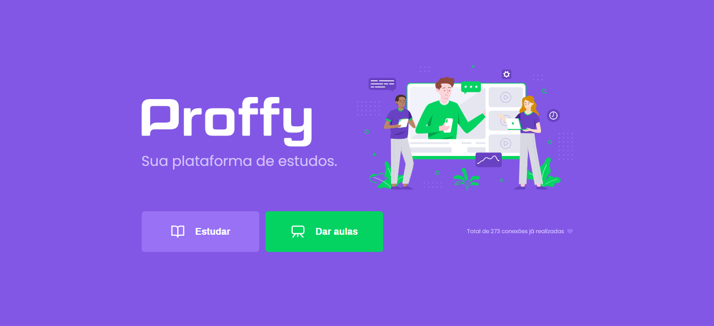
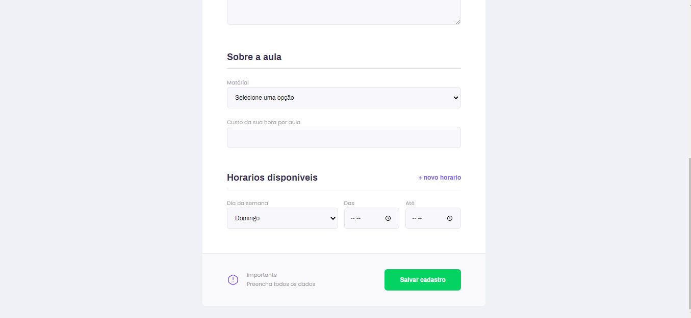

<h1 align="center">#SNL Projeto Proffy Web</h1>
<p align="center">


<h4 align="center"> 
	  ✔️ Projeto Proffy Web 📌 Concluído 🚀 
</h4>

### 💻 Sobre o projeto

 Na semana next level oferecida pela [Rocketseat](https://blog.rocketseat.com.br/primeira-next-level-week/) foi realizada a criação de uma aplicação web com o objetivo de auxiliar alunos a encontrarem professores particulares em um só lugar. O site permite o cadastro de professores de qualquer matéria para dar aulas nos horários mais confortáveis possibilitando o acesso aos estudos a todos os tipos de alunos interessados.

### :art: Layout  :point_right: Mobile-First

##### Web

<p align="center" style="display: flex; align-items: flex-start; justify-content: center;">
  
  
  
  
  
  
</p>

### :rocket: Executar o projeto

``` console
  # Instale as dependências
	yarn install
  # Instale tipos básicos do react
	npm install @types/react-router-dom
	npm install @types/react
	npm install @types/react-dom
  # Execute a aplicação 
	yarn start

```

### :hammer_and_wrench: Tecnologias
As seguintes ferramentas foram usadas na construção do projeto:

* React
* React JS
* React Router
* Typescript
* Axios
* Git 
